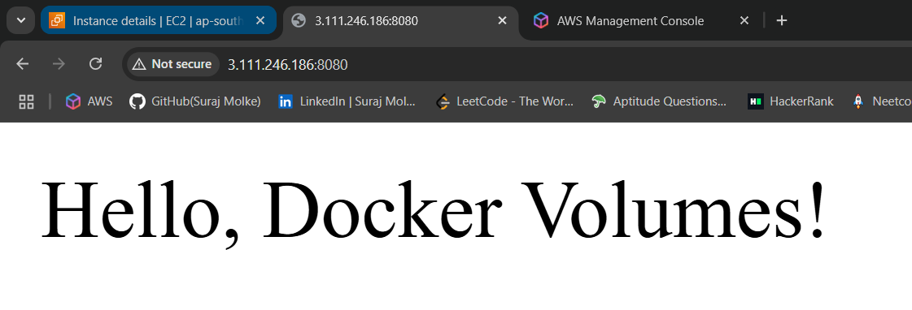

# Docker Task 2  
**Name:** Suraj Balaji Molke  
**Batch:** 7th Feb AWS  

---

## 1️⃣ What Are Docker Volumes?

Docker volumes are storage mechanisms used to persist data generated by containers. Unlike the container’s writable layer, volumes exist outside the lifecycle of a container.

### ✅ Why Volumes Are Used:
- **Data Persistence** across container restarts
- **Sharing Data** between multiple containers
- **Separation** of concerns (code vs data)
- **Backup/Restore** made easy

### 📌 Types of Docker Volumes

| Type            | Description |
|------------------|-------------|
| Named Volume     | Docker-managed, stored in default location |
| Anonymous Volume | Auto-created, no name, hard to reference |
| Bind Mount       | Host file/directory mapped to container |
| tmpfs Mount      | In-memory storage, lost after container stops |


---

## 2️⃣ Demonstration: Named Volume

### 🧪 Steps:

```bash
# Create Volume
docker volume create mydata

# Run Nginx container with volume
docker run -d --name mynginx -v mydata:/usr/share/nginx/html -p 8080:80 nginx

# Create index.html
echo "Hello, Docker Volumes!" > index.html

# Copy file into volume
sudo cp index.html /var/lib/docker/volumes/mydata/_data/

# Access in browser or curl
curl http://localhost:8080
```

📷 **Screenshot:**  


---

## 3️⃣ What Are Docker Networks?

Docker networks allow containers to talk to each other or the outside world.

### 🔄 Host vs Bridge Network

| Feature        | Host Network              | Bridge Network           |
|----------------|----------------------------|---------------------------|
| Network Stack  | Shared with host           | Isolated with Docker NAT |
| Port Mapping   | Not required               | Required                 |
| IP Address     | Same as host               | Virtual internal IP      |
| Isolation      | Low                        | High                     |
| Performance    | High                       | Medium (due to NAT)      |


---

## 4️⃣ Demonstration: Custom Bridge Network

```bash
# Create custom network
docker network create --driver bridge my_network

# Start containers in same network
docker run -d --name apache-server --network my_network httpd
docker run -d --name nginx-server --network my_network nginx

# Test communication
docker exec -it nginx-server bash
curl http://apache-server
```

📷 **Screenshot:**  


---

## 5️⃣ Dockerfile Instructions Overview

| Instruction  | Description |
|--------------|-------------|
| `FROM`       | Base image |
| `LABEL`      | Metadata |
| `RUN`        | Execute commands during build |
| `CMD`        | Default command |
| `ENTRYPOINT` | Fixed main executable |
| `COPY`       | Copy from host to image |
| `ADD`        | Copy + extract URL/archive |
| `EXPOSE`     | Define port |
| `WORKDIR`    | Set working directory |
| `ENV`        | Set environment variable |
| `VOLUME`     | Mount point |
| `ARG`        | Build-time variables |
| `USER`       | Run as specific user |
| `HEALTHCHECK`| Check container health |


---

## 6️⃣ CMD vs ENTRYPOINT

| Aspect         | CMD                            | ENTRYPOINT                         |
|----------------|--------------------------------|------------------------------------|
| Purpose        | Default command                | Fixed executable                   |
| Override       | Can override at runtime        | Hard to override                   |
| Use Case       | CLI tools                      | Services/scripts always running    |


---

## 7️⃣ ADD vs COPY in Dockerfile

| Feature     | COPY                         | ADD                                |
|-------------|-------------------------------|-------------------------------------|
| Use         | Basic file copy               | Copy + auto-extract or download     |
| Archives    | ❌                            | ✅                                 |
| URLs        | ❌                            | ✅                                 |
| Recommendation | Use unless ADD features needed | Use only when required            |

---

## 8️⃣ Node.js App with Volume & Network

### Dockerfile

```dockerfile
FROM node:18
WORKDIR /usr/src/app
COPY package*.json ./
RUN npm install
COPY . .
EXPOSE 3000
CMD ["node", "index.js"]
```

### docker-compose.yml

```yaml
version: '3.8'

services:
  nodeapp:
    build: .
    container_name: node-container
    ports:
      - "3000:3000"
    volumes:
      - node_data:/usr/src/app/data
    networks:
      - node_network

volumes:
  node_data:

networks:
  node_network:
    driver: bridge
```

```bash
docker-compose up --build -d
```

📷 **Screenshot:**  


---

## 9️⃣ Python App: Build and Push to Docker Hub

### app.py

```python
print("Hello from Suraj’s Python Docker app!")
```

### requirements.txt
```
requests
```

### Dockerfile

```dockerfile
FROM python:3.10-slim
WORKDIR /app
COPY requirements.txt ./
RUN pip install --no-cache-dir -r requirements.txt
COPY . .
CMD ["python", "app.py"]
```

### Build and Push:

```bash
docker build -t surajmolke/pythonimage .
docker login
docker push surajmolke/pythonimage
```

📷 **Screenshot:**  


---

## 🔚 Conclusion

✅ Covered:
- Docker Volumes and Networks  
- CMD vs ENTRYPOINT  
- COPY vs ADD  
- Node.js and Python app builds  
- Dockerfile and docker-compose usage  

---

## 📂 Folder Structure

```
dockertask2/
├── Dockerfile
├── docker-compose.yml
├── app.py
├── index.html
├── requirements.txt
├── README.md
└── screenshots/
    ├── volume-create.png
    ├── nginx-volume-test.png
    ├── docker-network-inspect.png
    ├── network-connectivity-test.png
    ├── dockerfile-sample.png
    ├── cmd-entrypoint.png
    ├── node-app-running.png
    └── python-image-push.png
```

---

## 🔄 Git Push Instructions

```bash
git init
git remote add origin https://github.com/Smolke9/dockertask2.git
git add .
git commit -m "Added Docker Task 2 with screenshots and documentation"
git push -u origin master
```

---

🛠️ Created by **Suraj Balaji Molke**  
📅 July 2025  
